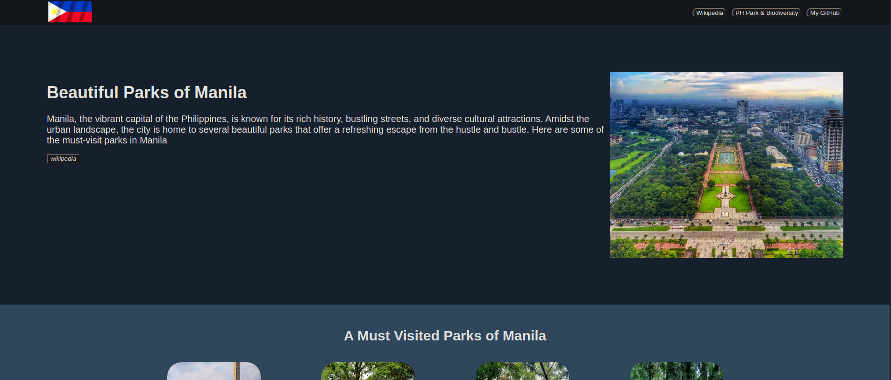

# Landing Page Project

## Overview

This project showcases my ability to demonstrate the use of Flexbox in CSS, as well as integrating various elements such as links, images, and other file formats into an HTML document.

## Features

Responsive Flexbox layout for structuring content.

Embedded links for easy navigation.

Displaying images within the webpage.

Integration of different file formats (e.g., PDFs, videos, and audio files) into HTML.

## Technologies Used

### TML5

### CSS3 (Flexbox)

## How to View the Project

Clone this repository:

**git clone <repository-url>**

Open the index.html file in your browser.

Screenshots

## Live Demo

Check out the live demo (here)(https://niclaus1.github.io/landing-page/).

## Author

[Niclaus Rendon] - [https://github.com/Niclaus1]